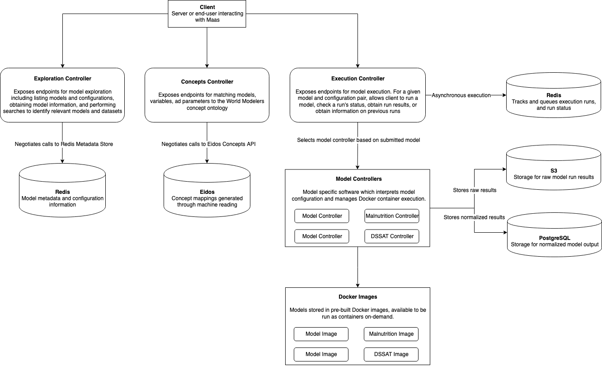

# ModelService
This repository contains the Models as a Service (MaaS) API for World Modelers.
## Contents

- [Design](#design)
	- [Project Goals](#project-goals)
	- [Architecture](#architecture)
- [Development](#development)
	- [Installation](#installation)
	- [Swagger Editor](#swagger-editor)
	- [Open API Code Generation](#open-api-code-generation)
	- [Running the REST Server](#running-the-rest-server)

## Design

### Project Goals
The goal of this project is to provide an easy to use, descriptive middleware layer API to facilitate model search and discovery, exploration, configuration, and execution. 

#### Model discovery
Model exploration is managed through the [`Exploration Controller`](https://github.com/WorldModelers/ModelService/blob/master/REST-Server/openapi_server/controllers/exploration_controller.py). The `Exploration Controller` allows a user to obtain a model's description, understand its parameters, obtain an example/default configuration, and understand its outputs.

This is further enabled through the [`Concepts Controller`](https://github.com/WorldModelers/ModelService/blob/master/REST-Server/openapi_server/controllers/concepts_controller.py) which maps `concepts` to models, model outputs, and model parameters. A client may request a list of all concepts that are mapped to models in MaaS and may submit a single concept to learn which related models, outputs and parameters are tied to it in MaaS.

#### Model execution
Model execution is managed by the [`Execution Controller`](https://github.com/WorldModelers/ModelService/blob/master/REST-Server/openapi_server/controllers/execution_controller.py). Models consist of pre-built Docker images that are hosted on an arbitrary server. Running a model requires the creation of a specific model controller, such as this one for [Kimetrica's malnutrition model](https://github.com/WorldModelers/ModelService/blob/master/REST-Server/openapi_server/kimetrica.py). The model controller is responsible for obtaining a model configuration and tasking Docker to run the model image inside a container with the given configuration. The model controller specifies a Docker container entrypoint, such as [this one](https://github.com/WorldModelers/ModelService/blob/master/Kimetrica-Integration/run.py). The model controller is then responsible for storing the output results file(s) to S3 and ingesting the normalized results into the MaaS database.

Models may be run using the `/run_model` endpoint. For more information on model execution, refer to [`docs/model-execution.md`](https://github.com/WorldModelers/ModelService/blob/master/docs/model-execution.md). Currently, MaaS supports the following models:

- Kimetrica Population Model
- Kimetrica Malnutrition Model
- Food Shocks Cascade Model
- DSSAT
- Atlas.ai Consumption Model
- Atlas.ai Asset Wealth Model
- CHIRPS
- CHIRPS-GEFS
- LPJmL Yield Anomalies
- World Pop Africa
- Flood Severity Index Model
- PIHM

### Architecture



#### Running MaaS

After [installation and setup](docs/installation.md), you can run MaaS from the `REST-Server` directory with:

```
python -m openapi_server
```

You can access the UI at [http://0.0.0.0:8080/ui](http://0.0.0.0:8080/ui).