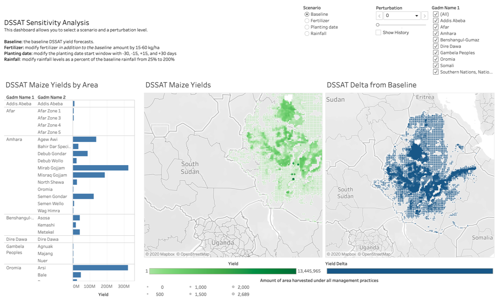

# MaaS: the Models as a Service API
The goal of the Models as a Service (MaaS) project is to provide an easy to use, descriptive middleware layer API to facilitate model search and discovery, exploration, configuration, and execution. MaaS support an array of agricultural, economic, hydrological, weather, and health models. MaaS provides two key innovations: 

1. MaaS allows users to to work with a **single lightweight and well-documented API** to execute a variety of models
2. MaaS extracts model output from various proprietary or complex formats and provides it to users in a **normalized, tabular format** 

	
MaaS allows users to interact with a variety of expert models across a wide ranging parameter space, enabling the creation of sophisticated sensitivity analyses such as the one above, which was made 
using a 3rd party tool, but powered by MaaS. 

## Documentation

For more information, please refer to our documentation at [https://worldmodelers.com/ModelService](https://worldmodelers.com/ModelService).

## Collaborators

MaaS collaborators include:

* [Atlas AI](https://www.atlasai.co/)
* [UCSB](https://ucsb.edu)
* [University of Florida](https://ufl.edu)
* [USC Information Sciences Institute](https://www.isi.edu/)
* [Penn State](https://psu.edu)
* [Kimetrica](https://kimetrica.com/)
* [Columbia University](https://www.columbia.edu/)
* [CSIRO](https://www.csiro.au/)
* [Potsdam Institute for Climate Impact Research](https://www.pik-potsdam.de/pik-frontpage)